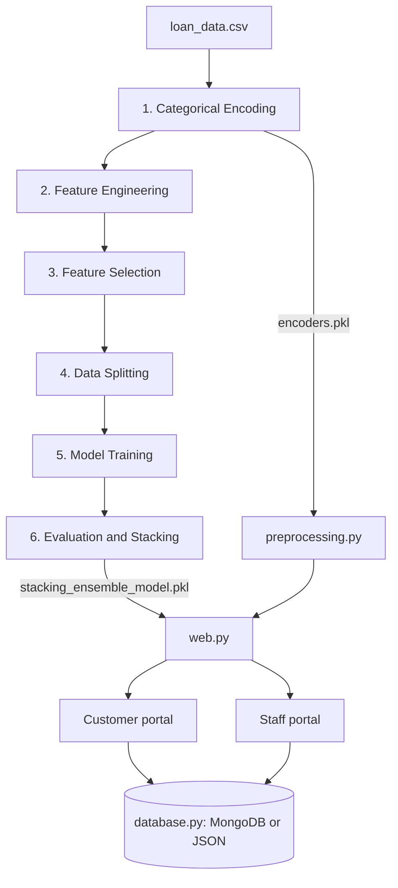

<h1 align="center">Personalized Decision Support System Using Banking Revenue Data</h1>
<p align="center">
  A loan default prediction pipeline and Streamlit app with role based portals for customers and underwriters.
</p>
<p align="center">
  
  
  
  
  
</p>
<p align="center">
  <a href="#overview">Overview</a> ·
  <a href="#quick-start">Quick Start</a> ·
  <a href="#system-design">System Design</a> ·
  <a href="#model-results-and-data">Results &amp; Data</a> ·
  <a href="#known-limitations">Known Limitations</a>
</p>

---

## Overview
This project trains a loan default model on `data/loan_data.csv` (45,000 applications, 14 columns, 22.2% defaults) and serves it through a Streamlit app. A six-step pipeline encodes the data, engineers and selects features, splits it, tunes four gradient-boosting and tree models, and combines them in a Stacking Ensemble.

The app has two portals. **Customers** enter a loan request and see only whether it is likely to be eligible, plus suggestions. **Staff** see the full analysis: default probability, expected profit, a SHAP explanation, and a suggested safer loan amount.
> **Before running:** the supplied archive already contains intermediate data, trained `.pkl` models, demo accounts in `data/db/`, and a `.env` file with default passwords. Read [Security notes](#security-notes) before going beyond a local demo. Pipeline steps 2 to 6 use Windows-style paths (`data\\...`); see [Known Limitations](#known-limitations).

## Features
| | Capability | Implementation |
|:---:|---|---|
| 🧠 | Six-step training pipeline | `main.py` loads and runs the files in `src/` in order |
| 🎯 | Tuned models | `optuna` with 20 trials per model; SMOTE balances the training set |
| 🧩 | Stacking Ensemble | XGBoost, Random Forest, LightGBM, Gradient Boosting; Logistic Regression meta-learner |
| 🔐 | Login and roles | Streamlit login; passwords stored as salted PBKDF2-HMAC-SHA256 hashes |
| 🙋 | Customer portal | Eligibility result and suggestions only; no probability or SHAP |
| 👔 | Staff portal | Historical dashboard, new applications, manual underwriting |
| 🔍 | Explainability | SHAP `KernelExplainer`, top 5 factors |
| 🔄 | What-if amounts | Lowers the loan amount until default probability is below 50% |
| 🗄️ | Storage | MongoDB when `MONGO_URI` is set, otherwise local JSON files |
| 🕶️ | PII masking | Masks name, phone, national ID, and email when displayed |

---

## Quick Start
### 1. Prepare Python and install dependencies
Use Python 3.10 or later. From the repository root:
```sh
python -m venv .venv
```

Activate the environment for your shell:
```sh
# macOS / Linux
source .venv/bin/activate

# Windows PowerShell
.venv\Scripts\Activate.ps1
```

```sh
python -m pip install -r requirements.txt
```

### 2. Train the models
```sh
python main.py
```

This runs all six steps and writes `encoders.pkl`, the model files, `shap_background_data.csv`, and the ROC and Feature Importance charts to `data/`. If a step fails, the pipeline stops and exits with code 1. Tuning (step 5) and Stacking (step 6) take the longest; Gradient Boosting alone took about 508 seconds in the saved run.

> The archive already includes these outputs, so you can skip this step to try the app. Re-running **overwrites** the files in `data/`.

### 3. Configure the environment
```sh
cp .env.example .env
```
Edit `.env` as needed. Leave `MONGO_URI` empty to store data in `data/db/*.json`.

### 4. Create demo accounts
```sh
python seed_users.py
```

Existing accounts are skipped. Defaults:

| Role | Username | Password |
|---|---|---|
| Staff | `staff01` | `Staff@123` |
| Customer | `customer01` | `Customer@123` |

Override the passwords with `SEED_STAFF_PW` and `SEED_CUSTOMER_PW` in `.env`.

### 5. Launch the app
```sh
streamlit run web.py
```

Run commands from the repository root. The app, `seed_users.py`, and the `src/` modules find `data/` relative to their own location, but pipeline steps 2 to 6 depend on the current working directory.

<details>
<summary><strong>Configuration and troubleshooting</strong></summary>

| Variable in `.env` | Sample value | Purpose |
|---|---|---|
| `MONGO_URI` | *(empty)* | MongoDB connection string; empty uses local JSON |
| `MONGO_DB` | `credit_dss` | MongoDB database name |
| `APP_SECRET` | `change-me-to-a-long-random-string` | Loaded into the config but not currently used |
| `PBKDF2_ITERATIONS` | `200000` | Password hashing iterations |
| `SEED_STAFF_PW` / `SEED_CUSTOMER_PW` | `Staff@123` / `Customer@123` | Default passwords for `seed_users.py` |

| Symptom | Check |
|---|---|
| "File ... does not exist" error in steps 2 to 6 (message printed in Vietnamese) | These steps build paths with `\`. Run on Windows, or switch them to `os.path.join`. |
| App warns that `stacking_ensemble_model.pkl` is missing | Run `python main.py`, or confirm the file is in `data/`. |
| `FileNotFoundError` for `encoders.pkl` | Rerun step 1 (`src/01_categorical_encoding.py`). |
| Cannot log in | Run `python seed_users.py`; check which backend the login page reports (MongoDB or Local JSON). |
| Console says MongoDB is unreachable and JSON fallback is used (message in Vietnamese) | `MONGO_URI` is wrong or the server did not answer within 2 seconds. |
| SHAP chart missing | The app shows a warning and renders the rest; check that `shap` is installed and `shap_background_data.csv` exists. |

</details>

---

## System Design


### Pipeline steps
| Step | File | What it does |
|---|---|---|
| 1 | `src/01_categorical_encoding.py` | Fits one `LabelEncoder` per text column and saves them all to `encoders.pkl` |
| 2 | `src/02_feature_engineering.py` | Adds `debt_to_income_ratio` and `age_to_experience_ratio` (zero experience is replaced by 0.5 to avoid division by zero) |
| 3 | `src/03_feature_selection.py` | RFECV with Random Forest (`f1`, 5 folds), then `SelectFromModel` with Gradient Boosting, keeping at most 9 features |
| 4 | `src/04_data_splitting.py` | Stratified 80/20 split, `random_state=42`: 36,000 train and 9,000 test rows |
| 5 | `src/05_model_training.py` | SMOTE on the training set; Optuna tunes four models; saves models and 100 background rows for SHAP |
| 6 | `src/06_evaluation_and_ensemble.py` | Retrains the four models with fixed hyperparameters, plots ROC and feature importance, trains and saves the Stacking model |

The nine selected features, in the order the model expects: `person_age`, `person_income`, `person_home_ownership`, `loan_amnt`, `loan_intent`, `loan_int_rate`, `credit_score`, `previous_loan_defaults_on_file`, `debt_to_income_ratio`.

### Application modules
| Module | Responsibility |
|---|---|
| `web.py` | Streamlit UI, role routing, prediction, SHAP, what-if |
| `src/auth.py` | Login form, minimal session data, logout |
| `src/security.py` | Reads `.env`, hashes and verifies passwords (constant-time compare), masks PII |
| `src/database.py` | MongoDB or JSON backend; filters applications by owner on the backend |
| `src/preprocessing.py` | Rebuilds steps 1 to 3 for raw input using the saved encoders and the exact 9-column order |
| `seed_users.py` | Creates initial accounts with hashed passwords |

### Access by role
| | Customer | Staff |
|---|:---:|:---:|
| Check eligibility and get suggestions | ✅ | ✅ |
| See default probability, SHAP, profit analysis | ❌ | ✅ |
| See own applications | ✅ | ✅ |
| See all applications (identifying data masked) | ❌ | ✅ |
| Historical data dashboard | ❌ | ✅ |
| Approve or reject applications | ❌ | ✅ |

**Decision rule.** A default probability `p` of 0.5 or higher means reject or not yet eligible. Expected profit is `loan_amnt × interest rate × (1 − p) − loan_amnt × p`. For the what-if, the app lowers the amount in $100 steps (down to $500) until `p < 0.5`; "Maximum support" is that amount and "High safety" is 80% of it.

## Model Results and Data
Test-set results (9,000 rows) for the four tuned models, from `data/step5_model_results.csv`:

| Model | Accuracy | F1 | ROC AUC | Precision | Recall | Train time (s) |
|---|---:|---:|---:|---:|---:|---:|
| XGBoost | 0.9334 | 0.8519 | 0.9784 | 0.8425 | 0.8615 | 48.7 |
| Random Forest | 0.8999 | 0.7956 | 0.9694 | 0.7281 | 0.8770 | 89.3 |
| LightGBM | 0.9308 | 0.8446 | 0.9771 | 0.8427 | 0.8465 | 35.0 |
| Gradient Boosting | 0.9308 | 0.8450 | 0.9773 | 0.8410 | 0.8490 | 508.2 |

Stacking metrics (accuracy, F1, ROC AUC, confusion matrix) are printed to the console in step 6 but **not saved**. The ROC curves and feature importance charts are saved as `data/ROC_Curves.png` and `data/Feature_Importance.png`.

A stored application (`data/db/new_applications.json` or the MongoDB `new_applications` collection):

```json
{
  "app_id": "9ccdd709d2ee",
  "owner": "customer01",
  "applicant": { "name": "Nguyễn Văn An", "phone": "", "national_id": "", "email": "" },
  "features": {
    "person_age": 30,
    "person_income": 50000,
    "person_home_ownership": "MORTGAGE",
    "loan_amnt": 10000,
    "loan_intent": "DEBTCONSOLIDATION",
    "loan_int_rate": 10.5,
    "credit_score": 650,
    "previous_loan_defaults_on_file": "No"
  },
  "result": { "eligible": true, "self_service": true },
  "decision": "PENDING",
  "created_at": "2026-05-31T11:22:38.550436+00:00"
}
```

After staff review, the record also holds `decision` (`APPROVED` or `REJECTED`), `reviewed_by`, and `reviewed_at`. Users are stored with a `password_hash` in the form `pbkdf2_sha256$<iterations>$<salt>$<hash>`.

### Security notes
- Do not commit `.env`. The supplied archive **includes** one with default values; change `APP_SECRET` and the seed passwords and delete the demo accounts before any real deployment.
- Demo credentials are also printed in the login form (`src/auth.py`); remove them once this is no longer a demo.
- `data/db/` ships with 2 demo accounts and 13 sample applications.
- Customer data isolation happens in `database.list_applications`: customers only receive applications whose `owner` equals their username.

---

## Project Files
| Path | Contents |
|---|---|
| `main.py` | Runs the six-step pipeline |
| `web.py` | Streamlit application |
| `seed_users.py` | Creates initial accounts |
| `src/` | Pipeline steps `01_` to `06_`, plus `preprocessing.py`, `security.py`, `database.py`, `auth.py` |
| `data/` | Source data, per-step outputs, `.pkl` models, `encoders.pkl`, charts, `db/` |
| `.env.example` | Environment variable template |
| `requirements.txt` | Python packages |
| `README_improvements.md` | Notes on four improvements over the earlier version |

## Known Limitations
<details>
<summary><strong>Source review findings</strong></summary>

| Area | Current behavior |
|---|---|
| Paths | Steps 2 to 6 use `"data\\..."` strings and work correctly only on Windows. Step 1, `web.py`, and the other `src/` modules use `os.path`. |
| Model consistency | Step 6 retrains the four models with hyperparameters hardcoded in source rather than reading step 5's Optuna results, so the Stacking model can differ from the saved `*_loan_model.pkl` files. |
| Stacking evaluation | Printed to the console only; `step5_model_results.csv` has no Stacking row. |
| Unseen labels | `preprocessing.py` silently maps an unknown category to class 0. |
| Approve / reject | Both buttons sit inside the "Run full analysis" button's block. Given how Streamlit reruns the script, clicks may not register; move them out or use `session_state`. |
| Saving applications | Each click on "Check loan eligibility" creates a new application, even with unchanged input; only `eligible` is stored, not the probability. |
| Security | No limit on failed logins; phone and national ID are stored unencrypted and masked only on display; `APP_SECRET` is unused. |
| Packaging | The archive includes `__pycache__`, `.env`, generated data, and `.pkl` models (`rf_loan_model.pkl` is about 29 MB); there is no `.gitignore`, test suite, or license file. |
| Data | The model has not been validated on data outside `loan_data.csv`. |

</details>

## Roadmap
- Use `os.path.join` in steps 2 to 6 so the pipeline runs on any operating system.
- Feed the best Optuna parameters into step 6 and save Stacking metrics to a file.
- Fix the approve / reject flow and prevent duplicate applications.
- Add login rate limiting, encrypt PII at rest, and remove demo credentials from the source.
- Warn or fail on unseen categorical labels instead of mapping them to class 0.
- Add a `.gitignore` and automated tests for `preprocessing.py` and `database.py`.

## Contributing
Open an issue or submit a focused pull request. Include the Python version, a reproducible input example, and the commands used to verify changes. Do not commit `.env`, real customer data, or local virtual environments.

## License
No license file is included in the supplied archive. Ask the project owner for permission before redistributing code or bundled data.

---

<p align="center"><a href="#personalized-credit-decision-support-system">Back to top ↑</a></p>
